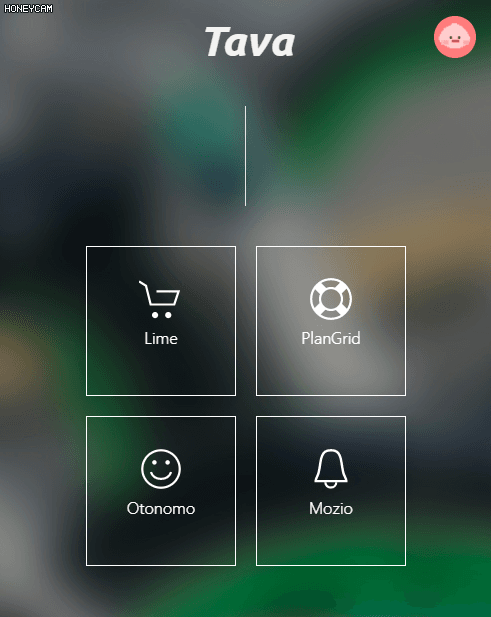

# :bike:Tava
## Tava-Frontend

> Only *Ditibike* test available

### Overview
* `/index.html`: Main layout
* `/public/js/app.js`: Event handler methods for main logic
* `/public/js/txs.js`: Methods for interacting with AVA nodes
* `/public/js/googleauth.js`: Methods for google auth api
* `/public/js/utils.js`: Util functions
* `/public/src/citibike_stations.csv`: Citibike station data

### Getting Started
* Requirements : [nodeJS](https://nodejs.org/en/download/)

1. Install packages
```
npm install
```

2. Run server
```
node server.js
```
